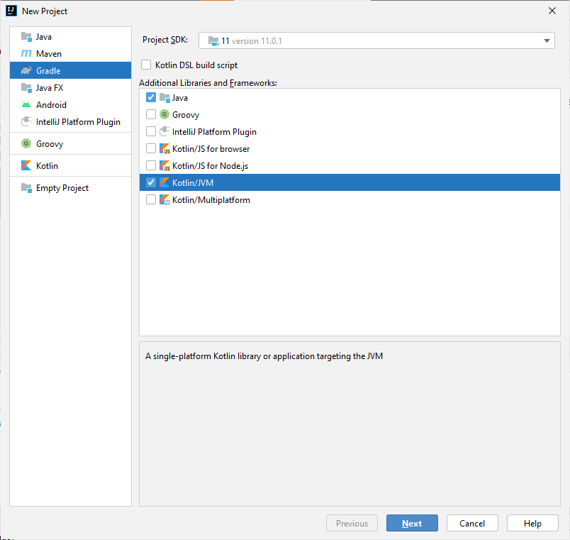

# Kotlin-JavaFX-Gradle-SimpleSetup
The simplest and best setup for kotlin project with JavaFX and Gradle.

This is a complete step by step guilde to use OpenJFX with Kotlin and Gradle.

# **Pre-requisites: **
**JDK version used: 11.0.1**, All versions of JDK 11 should work

**Kotlin plugin used: 1.4.32**

**Gradle version used: 5.3.1**
(You can check steps to check Gradle version in _Steps to Implement_ section)

**IntelliJ Idea IDE**

# **Steps to Implement: **
Step 1: Open IntelliJ Idea and click on create new project.

Select Gradle, Java and Kotlin like in following image.

once the project is created check your Gradle version

(You must use the same gradle version used by me. OpenJFX has problems with newer versions of Gradle.

There is an open issue on OpenJFX Github, If issue is solved I'll update it here)

(To check and change your gradle version, refer to following file)

(After creating project using Steps mentioned in above,

In Project Directory, go to YourProject>> gradle>> wrapper>> gradle-wrapper.properties

Compare it with my gradle-wrapper.properties)

**Step 2:** Create a new Kotlin class "_MainClass_". Copy and paste contents of my main class.

**Step 3:** Go to your _build.gradle_ file and compare it with mine. You can copy and paste contents of my _build.gradle_.

Sync the gradle file. Gradle will download all plugins and libraries.

**Step 4:** Create _FXMLController class, scene.fxml, styles.css_ files and all above files exactly where I have them in my project

**Step 5:** Create _module-info.java_ file in java folder.

**Step 6:** Run the gradle project from gradle tab. Enjoy...!!
